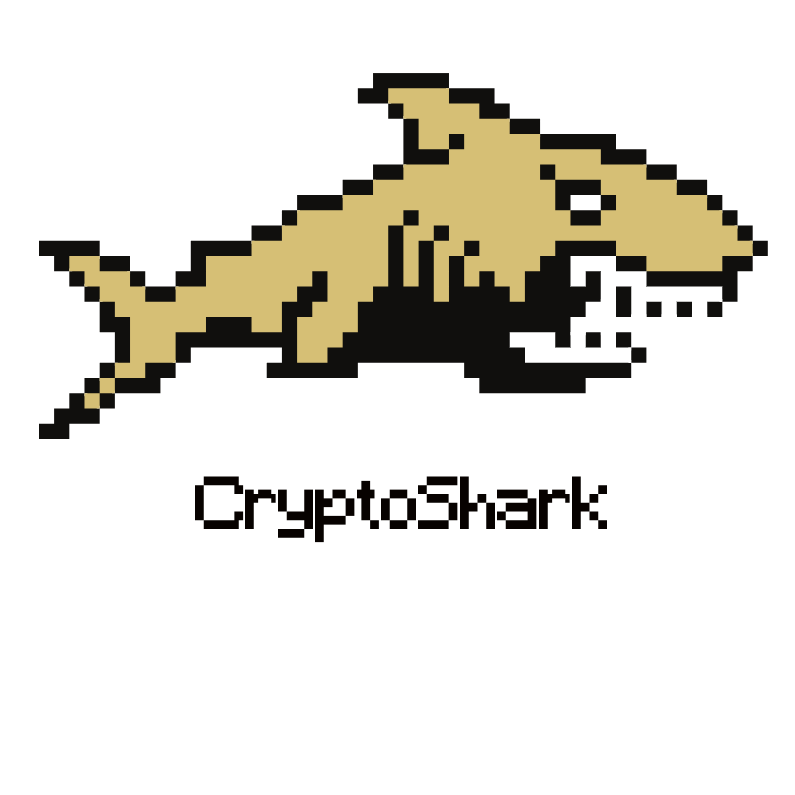
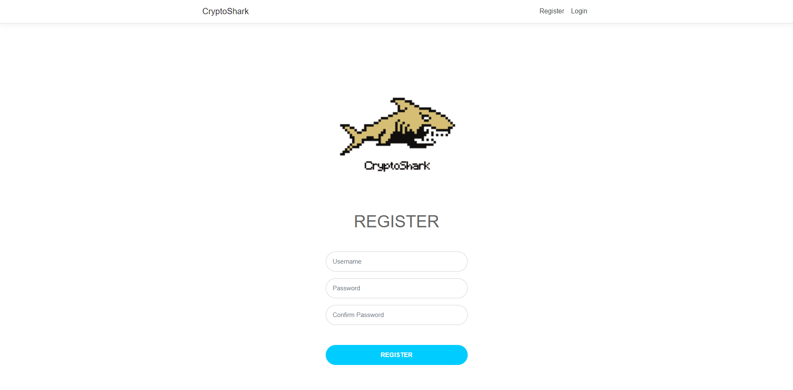
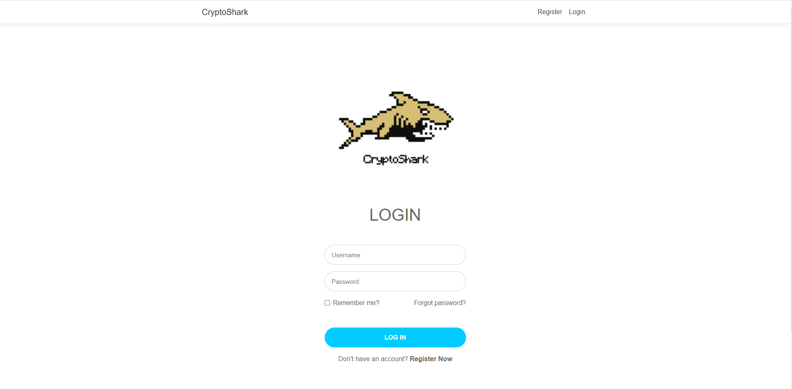
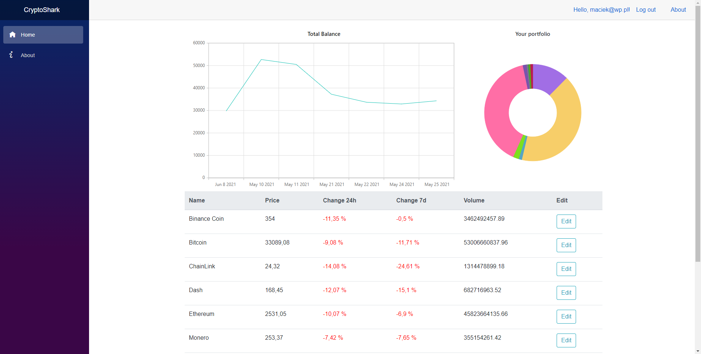
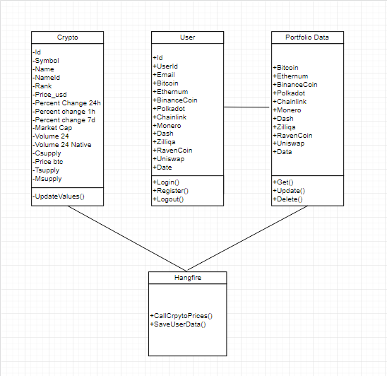
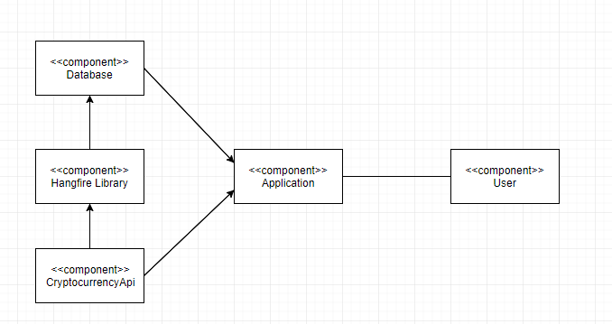

# CryptoShark
Menadżer zarządzania portelem kryptowalutowym.

## Stack Technologiczny
* Blazor Server
* Dapper
* MsSql
* Hangfire
* Syncfusion
* Bootstrap
* Xunit, Bunit
* Identity

## Specyfikacja wymagań

### Wymagania funkcjonalne

| ID | Kategoria | Podkategoria | Nazwa krótka | Opis | Priorytet
| ------------- | ------------- |------|------|---------|--------|
| F1  | Funkcjonalne  | Autoryzacja  | Autoryzacja | Możliwość rejestracji oraz zalogowania się do aplikacji. | P1
| F2  | Funkcjonalne  |-----| Bieżące ceny aktywów | Aplikacja powinna na bieżąco pokazywać aktualną wycenę danego aktywu na podstawie średniej ceny z najpopularniejszych giełd. Dane będą pobierane z zewnętrznego API.   | P1
| F3 | Funkcjonalne  |Wizualizacja danych | Czytelne oraz interaktywne  wykresy  | Wdrożone powinny zostać interaktywne wykresy dzięki którym użytkownik będzie mógł na bieżąco śledzić stan swojego portfolio   | P1
| F4  | Funkcjonalne  |Statystyki| Sekcja do analizy technicznej   | Strona na której użytkownik będzie mógł sprawdzić wybrane wskaźniki w celu poczynienia dalszych kroków inwestycyjnych.  | P2
| F5  | Funkcjonalne  |Bazy danych | Historyczne wyceny  |Ceny aktywów powinny być zapisywane w bazie danych tak aby lepiej śledzić wartość portfela krypowalutowego użytkownika. | P1
| F6 | Funkcjonalne | UI | Szata graficzna  | Prosty, interaktywny oraz przejrzysty interfejs  | P1
| F7 | Funkcjonalne | Statystyki | Lista z wybranymi aktywami  |Użytkownik może śledzić interesujące go aktywa | P1

### Wymagania niefunkcjonalne
| ID | Kategoria | Podkategoria | Nazwa krótka | Opis | Priorytet
| ------------- | ------------- |------|------|---------|--------|
| NF1 | Niefunkcjonalne | Autoryzacja | Wdrożenie  Autoryzacji zewnętrzenej  |Użytkownik może zalogować się używając zewnętrznej autoryzacji | P1
| NF2 | Niefunkcjonalne | Dane| Api |Aplikacja komunikuje się z api | P1
| NF3 | Niefunkcjonalne |Dane| Autozapisy  |Aplikacja automatycznie zapisuje dane z api oraz dane użytkownika (co godzinę) | P1
| NF4 | Niefunkcjonalne | Dane| Komunikacja z bazą danych  |Aplikacja powinna komunikować się z bazą przez utworzone wcześniej funkcje | P1
| NF5 | Niefunkcjonalne | Dane| Spójność  |Wszystkie dane powinny ze sobą współgrać | P3
| NF6 | Niefunkcjonalne | Dane| Obsługa błędów  |Zarówno baza danych jak i aplikacja powinny być zabezpieczone przed błędami, np. Z powodu błędu api. | P2
| NF7 | Niefunkcjonalne | UI | Interfejs  |Interfejs powinien być prosty w obsłudze przez użytkownika | P3
| NF8 | Niefunkcjonalne | UI | Wizualizacja danych  |Dane powinny być zaprezentowane użytkownikowi w przystępny dla niego sposób między innymi w formie wykresów (wykres kołowy, świeczkowy itp.) | P3
| NF9 | Niefunkcjonalne | UI | Responsywność  |Strona powinna być przystosowana do różnych wielkości ekranu. | P2
| NF10| Niefunkcjonalne | UI | Język aplikacji  |Aplikacja stworzona w języku polskim | P1
| NF11| Niefunkcjonalne | Bezpieczeństwo  | Obsługa błędów  |Strona powinna być odporna na błędy, zarówno po stronie użytkownika jak i po stronie serwera(try/catch, dedykowane strony błędów) | P3
| NF12| Niefunkcjonalne | Bezpieczeństwo  | Testowanie aplikacji  |Kod aplikacji powinien być pokryty testami w jak największym procencie. | P1
| NF13| Niefunkcjonalne | UI | Stworzenie logo  |Stworzenie unikalnego logo dla aplikacji. | P3

## Screenshots
### Register Page

### Login Page

### Main Page

## Diagramy

### UML

### Komponenty

### Scenariusze testów
| Id | Nazwa | Opis | Typ | Czynności przygotowawcze | Przebieg testu |
| --- | --- | --- | --- | --- | --- |
| 1 |Współpraca z API kryptowalutowym|Przetestowanie działania zewnętrznego API, jego stabilności oraz współpracy z naszą aplikacją. |Testy funkcjonalne| Uruchomienie projektu|Monitorowanie działania biblioteki Hangfire oraz sprawdzanie czy API jest cały czas stabilne.| 
| 2 |Wizualizacja danych | Sprawdzenie działania wykresów|Testy funkcjonalne| Uruchomienie aplikacji oraz zalogowanie się do niej|Sprawdzenie czy dane przedstawione na wykresie pokrywają się z danymi w bazie danych.| 
| 3 |CRUD dla danych użytkownika|Sprawdzanie poprawności pobierania, edycji, usuwania i wyświetlania danych z kontrolera użytkownika|Testy funkcjonalne|Uruchomienie aplikacji, zalogowanie się do niej oraz przeprowadzenie wszystkich czynności CRUD |Sprawdzenie czy wszytkie funkcjonalności działają oraz czy nie mają żadnych błędów.| 
| 4 | Autoryzacja|Sprawdzenie działania autoryzacji w aplikacji|Testy funkcjonalne |Uruchomienie aplikacji| Przetestowanie dostępu do poszczególnych stron przez użytkownika zalogowanego oraz niezalogowanego.|
| 5 | Szata graficzna |Sprawdzenie przejrzystości interfejsu oraz praca nad animacjami|-|Uruchomienie aplikacji|Weryfikacja interfejsu graficznego.|
| 6 | Testy bezpieczeństwa |Sprawdzenie czy aplikacja jest bezpieczna|Testy funkcjonalne|Próba złamania zabezpieczeń aplikacji|-|

## Autorzy

Autorzy: Maciej Winnik, Dominika Drela, Piotr Kiedrowski
